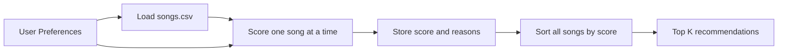
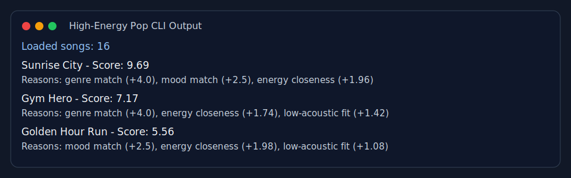
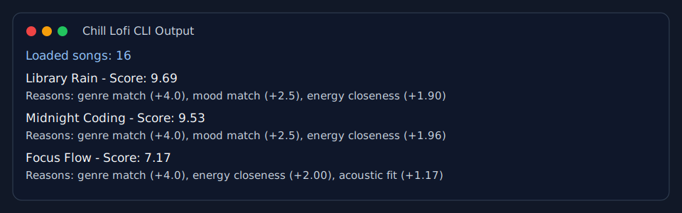
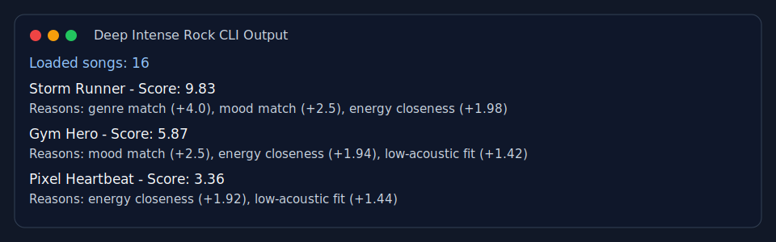

# Music Recommender Simulation

## Project Summary

This project simulates a small music recommendation system using a simple weighted-score model. The program reads a catalog of 16 songs, compares each song to a user taste profile, and returns the top matches with both score reasons and a short explanation.

Real platforms like Spotify, TikTok, and YouTube usually mix two big ideas:

- **Collaborative filtering**: recommend things based on patterns across many users, such as likes, skips, playlists, watch time, and repeat listens.
- **Content-based filtering**: recommend things based on attributes of the item itself, such as genre, mood, energy, tempo, or acousticness.

My project focuses on the content-based side only so the ranking logic stays transparent and easy to explain.

---

## How The System Works

### Features in the Simulation

Each `Song` stores:

- `genre`
- `mood`
- `energy`
- `tempo_bpm`
- `valence`
- `danceability`
- `acousticness`

Each `UserProfile` stores:

- favorite genre
- favorite mood
- target energy
- whether the user prefers acoustic sounding music

### Algorithm Recipe

My recommender uses this weighted scoring rule:

- `+4.0` for a genre match
- `+2.5` for a mood match
- up to `+2.0` for energy closeness
- up to `+1.5` for acousticness fit

Energy is scored by closeness, not by simply being high or low. That means a song with energy `0.78` is a better match for a user target of `0.80` than a song with energy `0.30`.

The system has two related steps:

- **Scoring rule**: judge one song against one user profile
- **Ranking rule**: sort the full catalog from highest score to lowest score and return the top `k`

### Data Flow



### Data Notes

I expanded the starter catalog from 10 songs to 16 songs. The new rows add more genre and mood variety, including `edm`, `folk`, `r&b`, `hyperpop`, `acoustic`, and `indie`.

### Expected Biases

- The catalog is still small, so some listeners will be served better than others.
- Genre is the strongest weight, so the recommender can create a mini filter bubble by preferring same-genre matches.
- The acoustic preference is binary, which oversimplifies real taste.

---

## Getting Started

### Setup

```bash
python3 -m venv .venv
source .venv/bin/activate
pip install -r requirements.txt
```

### Run the CLI

```bash
python3 -m src.main
```

The CLI prints recommendations for three profiles:

- `High-Energy Pop`
- `Chill Lofi`
- `Deep Intense Rock`

### Run Tests

```bash
pytest
```

The test suite checks:

- OOP recommendation ordering
- explanation generation
- functional scoring behavior
- energy sensitivity
- acoustic preference behavior
- CSV parsing
- sorted top-`k` output

---

## Terminal Snapshots

### High-Energy Pop



### Chill Lofi



### Deep Intense Rock



---

## Experiments You Tried

I tested three user profiles to stress the system:

- **High-Energy Pop** returned `Sunrise City`, `Gym Hero`, and `Golden Hour Run`.
- **Chill Lofi** returned `Library Rain`, `Midnight Coding`, and `Focus Flow`.
- **Deep Intense Rock** returned `Storm Runner`, `Gym Hero`, and `Pixel Heartbeat`.

These outputs mostly matched my intuition. `Storm Runner` clearly fit the intense rock listener, while `Library Rain` and `Midnight Coding` made sense for the chill acoustic-leaning user.

I also ran a weight-shift experiment:

- Lowering the genre weight from `4.0` to `1.5` caused `Golden Hour Run` and `Rooftop Lights` to move ahead of `Gym Hero` for the pop/happy user.
- Raising the energy weight from `2.0` to `4.0` boosted songs with similar energy, but `Sunrise City` still stayed in first place for the pop profile.

That showed me the system is sensitive to weight choices, not just the dataset itself.

---

## Limitations and Risks

- The catalog is still tiny at 16 songs, so coverage is limited.
- Some moods and genres only appear once, which makes the system less reliable for those users.
- The model ignores lyrics, artist familiarity, language, culture, and long-term listening behavior.
- The acoustic preference is too simple because it treats users as either acoustic or not acoustic.
- The recommender favors the closest match and does not actively add diversity, so repeated styles can dominate.

See the [model card](model_card.md) and [reflection](reflection.md) for a deeper discussion.

---

## Reflection

This project helped me see how recommendation systems transform data into predictions. A recommendation can feel smart even when it comes from a short scoring formula, because the final ranking hides many design choices about what counts as similarity.

It also made bias more visible. Even after expanding the catalog, some listeners are still easier to satisfy than others because the data and weights are uneven. That made it clear that human judgment matters when choosing the data, features, and priorities behind the model.
