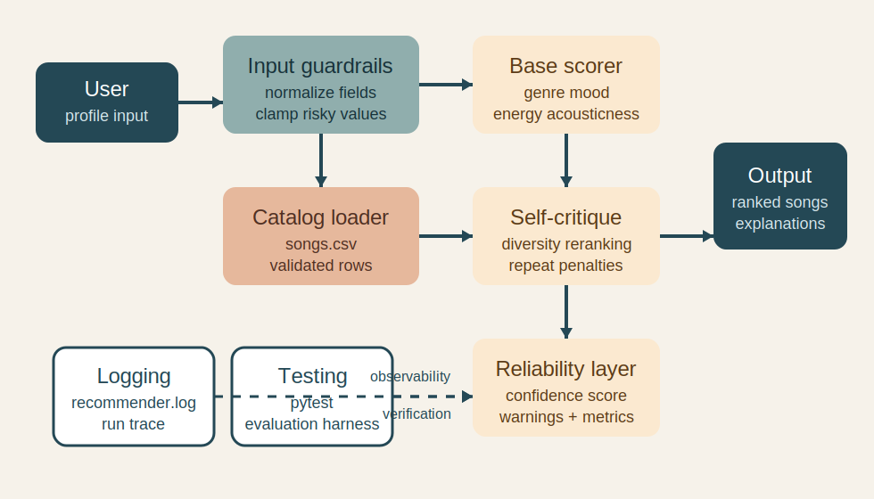

# VibeMatch Reliable Recommender

VibeMatch Reliable Recommender is an applied AI system that takes a small content-based music recommender and makes it more trustworthy and more expressive. The system still ranks songs using transparent feature scoring, but it now adds retrieval-backed explanations, constrained explanation styles, an observable multi-step workflow trace, guardrails, confidence scoring, a self-critique reranking loop, structured logging, and an evaluation harness so the outputs can be inspected instead of simply trusted.

## Original Project

This repo extends my **Module 3 project, "Music Recommender Simulation."** The original version loaded a 16-song catalog, compared each song to a user profile, and returned top matches using weighted features like genre, mood, energy, and acousticness. It already explained its rankings, but it did not measure confidence, detect repetitive recommendations, or validate risky inputs.

## Why This Matters

Recommendation systems can feel smart even when they are fragile. I wanted to keep the transparency of the original rule-based model while adding reliability behavior that makes the system more useful for a portfolio review:

- multi-source retrieval from custom local knowledge documents
- constrained explanation styles that measurably differ from baseline phrasing
- an observable workflow trace for the recommendation chain
- input guardrails normalize missing or invalid preferences
- a self-critique loop reranks repetitive top-k lists
- each recommendation gets a confidence score
- logs capture what the system did during a run
- an evaluation script reports how often warnings and penalties appear

## How This Matches The Rubric

### 1. Base project and original scope

This project clearly extends my Module 3 project, **Music Recommender Simulation**. The original version recommended songs from a 16-song catalog using weighted scoring across genre, mood, energy, and acousticness, then returned explanations for the top matches.

### 2. Substantial new AI feature

The main new AI feature is a **reliability harness** built directly into the recommender. It adds:

- retrieval-backed context from custom knowledge documents
- confidence scoring for each recommendation
- input guardrails for missing or invalid preferences
- a self-critique reranking loop to reduce repetitive top-k results
- observable workflow steps in the report output
- specialized explanation styles (`plain`, `curator`, `studio`)
- runtime logging and an evaluation script for repeated testing

This is integrated into the real system workflow, not shown as a separate demo.

### 3. System architecture diagram

The architecture diagram in `assets/system-architecture.svg` shows:

- the user input path
- local knowledge retrieval
- guardrails and catalog loading
- scoring and self-critique reranking
- reliability metrics and final output
- where logging and testing connect to the system

### 4. End-to-end system demonstration

The project runs end-to-end through:

- `python3 -m src.main` for the live recommender demo
- `python3 -m src.evaluate` for multi-input evaluation
- `python3 -m pytest` for automated verification

### 5. Reliability / evaluation / guardrails

This project includes all three:

- guardrails: input normalization, missing-field warnings, invalid-energy clamping
- reliability scoring: per-song confidence plus report-level metrics
- evaluation: a script that runs the system on predefined profiles and prints a summary

### 6b. Stretch features implemented

This project now also implements all four stretch categories:

- `RAG Enhancement`: retrieval from two custom local documents, `knowledge/genre_notes.md` and `knowledge/mood_notes.md`
- `Agentic Workflow Enhancement`: observable workflow trace printed in the CLI output
- `Fine-Tuning or Specialization Behavior`: constrained explanation styles that measurably differ from baseline
- `Test Harness or Evaluation Script`: `python3 -m src.evaluate`

### 6. Documentation

This README includes:

- project summary
- original project identification
- setup instructions
- run instructions
- sample inputs and outputs
- design decisions
- testing summary
- reflection

### 7. Reflection on AI collaboration and design

The reflection and model card explain:

- how AI was used during development
- one helpful AI suggestion
- one flawed AI suggestion
- system limitations, bias risks, and future improvements

## Architecture Overview



The system works in six steps:

1. A user profile enters the system through the CLI or evaluation harness.
2. Input guardrails normalize fields, clamp unsafe values, and attach warnings.
3. A local retrieval step pulls matching notes from the custom genre and mood knowledge documents.
4. The base scorer compares each song to the profile using weighted genre, mood, energy, and acousticness signals.
5. A self-critique reranking loop applies penalties when the top list becomes too repetitive by genre or artist.
6. A reliability layer assigns confidence scores, emits warnings, and returns the final ranked recommendations plus a workflow trace.

Humans stay in the loop through the printed explanations, warnings, log file, and the evaluation script that summarizes where the system is still weak.

## Project Structure

- `src/recommender.py`: scoring logic, guardrails, confidence scoring, and reranking
- `src/main.py`: end-to-end CLI demo
- `src/evaluate.py`: evaluation harness for predefined listener profiles
- `knowledge/genre_notes.md`: retrieval notes for genres
- `knowledge/mood_notes.md`: retrieval notes for moods
- `tests/test_recommender.py`: automated test suite
- `assets/system-architecture.svg`: system diagram
- `logs/recommender.log`: runtime log file created when the CLI runs

## Setup

```bash
python3 -m venv .venv
source .venv/bin/activate
python -m pip install -r requirements.txt
```

## Run The System

Run the main demo:

```bash
python3 -m src.main
```

Run the evaluation harness:

```bash
python3 -m src.evaluate
```

Run the tests:

```bash
python3 -m pytest
```

## Sample Interactions

### Example 1: High-Energy Pop

Input:

```python
{"genre": "pop", "mood": "happy", "energy": 0.8}
```

Output highlights:

```text
Top pick: Sunrise City
Average confidence: 0.71
Warning: Self-critique loop applied a genre-diversity penalty
Retrieval: genre_notes/pop + mood_notes/happy
Style: curator
```

The system still recommends `Sunrise City` first, but it also penalizes `Gym Hero` for repeating the same genre too early in the list.

### Example 2: Chill Lofi

Input:

```python
{"genre": "lofi", "mood": "chill", "energy": 0.4, "likes_acoustic": True}
```

Output highlights:

```text
Top pick: Library Rain
Average confidence: 0.72
Warnings: genre-diversity penalties, artist-diversity penalty, diversity warning
Workflow trace: retrieval -> scoring -> reranking -> confidence
```

This profile shows why the reliability layer matters. The strongest matches are concentrated in lofi tracks, so the system explicitly says the final top-k list is still somewhat narrow even after reranking.

### Example 3: Guardrail Stress Test

Input:

```python
{"mood": "happy", "energy": 1.3, "likes_acoustic": False}
```

Output highlights:

```text
Top pick: Sunrise City
Average confidence: 0.59
Warnings: energy was clamped to 1.00, missing genre disabled genre matching
Retrieval-backed explanation: yes
```

This case proves the system does not silently accept risky input. It corrects the invalid energy value, explains that genre matching is disabled, and reports lower confidence for the final ranking.

## Design Decisions And Trade-Offs

### 1. Keep the original scorer, add a reliability layer around it

I kept the original weighted formula because it is easy to explain. Instead of hiding that logic behind a more complex model, I built a second layer that critiques and evaluates the recommendations after scoring.

### 2. Use deterministic guardrails instead of an external model

I chose rule-based guardrails because this project needs to run reproducibly for a reviewer. That means the system behaves the same way every time, which makes testing and demonstration easier.

### 3. Penalize repetition, but not too aggressively

The reranking loop subtracts small penalties for repeated genres or artists. This does not fully replace the original score, but it keeps the top-k list from becoming overly repetitive when multiple songs are very close.

### 4. Retrieve local music-knowledge notes before building the final explanation

I added two custom knowledge sources, one for genre behavior and one for mood behavior. The recommender retrieves matching sections from those documents before composing the final explanation, which makes the output more specific than the original baseline.

### 5. Use constrained explanation styles instead of one fixed voice

The recommender now supports `plain`, `curator`, and `studio` styles. This lets me demonstrate specialized behavior without replacing the ranking logic, and the evaluation script shows that the specialized style output measurably differs from baseline phrasing.

## Reliability And Testing Summary

The project includes automated tests, retrieval-backed explanation checks, and an evaluation harness.

- `13/13` automated tests passed.
- The evaluation harness ran `4` profiles across the full catalog.
- Average confidence across those profiles was `0.67`.
- Self-critique penalties triggered in `2/4` profiles.
- Diversity warnings triggered in `1/4` profiles.
- Input guardrail warnings triggered in `1/4` profiles.
- Retrieval-backed explanations appeared in `4/4` profiles.
- Specialized style output measurably differed from baseline.

What worked:

- strong profiles like pop/happy and rock/intense still return intuitive top picks
- the system now surfaces when a result list is narrow or low-confidence
- invalid inputs no longer pass through silently
- retrieval makes the explanations more specific than the original scorer alone
- the workflow trace makes the multi-step reasoning chain visible for demo and debugging

What did not work perfectly:

- some low-ranked songs still have weak confidence because the catalog is tiny
- the reranking loop improves diversity, but it cannot create diversity that is not present in the data
- retrieval is still limited to a small local knowledge base rather than a large real-world corpus

## Reflection

This project taught me that "trustworthy AI" is often about the layers around the model as much as the model itself. The original recommender could already rank songs, but the newer version is more professional because it shows its uncertainty, critiques repetitive results, and records what happened during a run. That made the system feel much closer to a real applied AI product than a classroom prototype.

## Portfolio Note

What this project says about me as an AI engineer: I like building systems that are not only functional, but inspectable. Instead of stopping at "the model gave an answer," I focused on whether the system could explain its choices, detect weak cases, and surface failure modes clearly enough for a human reviewer to trust the workflow.

## Loom Walkthrough

Add your Loom walkthrough link here before submission.

### Suggested 5-7 minute demo script

#### 1. Open with the project goal

Say:

> "This project extends my Module 3 Music Recommender Simulation into an applied AI system. I kept the original transparent scorer, then added multi-source retrieval, specialized explanation styles, an observable workflow trace, guardrails, confidence scoring, self-critique reranking, logging, and an evaluation harness."

#### 2. Show the main end-to-end run

Run:

```bash
python3 -m src.main
```

Point out:

- the recommender still returns ranked songs
- each result now includes retrieved context from the local knowledge base
- the explanation style is intentionally specialized and different from the baseline voice
- the workflow trace makes the decision chain visible
- each result now shows confidence
- the system prints warnings when a profile triggers a weak or narrow recommendation set
- the self-check message explains when reranking changed the output

#### 3. Highlight 3 concrete inputs

Use these examples from the CLI output:

1. `High-Energy Pop`
   - show `Sunrise City` as the top pick
   - explain that the system applied a genre-diversity penalty to avoid a more repetitive top-k list

2. `Chill Lofi`
   - show that the system still recommends `Library Rain`
   - point out the diversity warning and the artist/genre penalties
   - explain that this is the self-critique behavior
   - point out the retrieved genre and mood notes that ground the explanation

3. `Guardrail Stress Test`
   - run `python3 -m src.evaluate`
   - highlight the profile with `energy=1.3` and no genre preference
   - show that the system clamps the energy input, disables missing-genre matching, and reports lower reliability

#### 4. Show the evaluation harness

Run:

```bash
python3 -m src.evaluate
```

Say:

> "This script is my evaluation harness. It runs multiple predefined profiles, then summarizes average confidence, self-critique penalties, diversity warnings, and input guardrail warnings."

This is important because it proves the AI features are tested across multiple cases rather than only one happy-path demo.

Also point out:

- retrieval-backed explanations appeared in all evaluated profiles
- the specialized style output differs from baseline wording

#### 5. Close with trust and reflection

Say:

> "What makes this an applied AI system instead of just a recommendation script is that it does not only rank songs. It also measures confidence, critiques repetitive outputs, validates risky input, and documents where it is still limited."

If you want to mention stretch work directly, add:

> "I also extended it with local retrieval, a visible workflow trace, and constrained explanation styles, so the system now covers all four stretch categories in the rubric."

### Video checklist

- show `python3 -m src.main`
- show `python3 -m src.evaluate`
- demonstrate at least 2-3 inputs
- point to retrieved knowledge sections
- point to the workflow trace
- point to confidence scores and warnings
- explain one self-critique example
- explain one guardrail example
